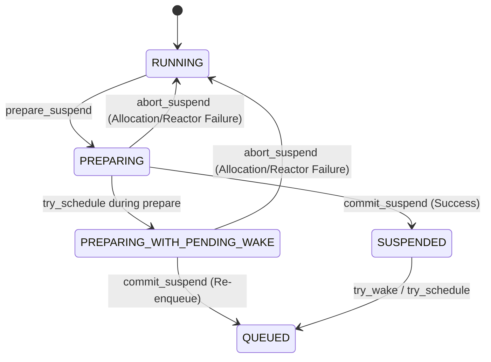

# Async Runtime Phase 3 (AR-P3): Multi-Platform Reactor Tokenization Specification

---

## 1. Architectural Overview & Invariants

Async Runtime Phase 3 (AR-P3) completely eliminates raw coroutine frame pointers (`coro_handle`) from OS Reactor event registration and dispatch loops across all supported target operating systems.

### Core Invariants:
1. **Zero Raw Frame Addresses**: Operating System Reactors (`epoll`, `kqueue`, `select`) receive **only** packed 64-bit `event_key` tokens:
   $$\text{event\_key} = ((\text{wait\_id} \text{ as } u64) \ll 32) \mid (\text{slot\_gen} \text{ as } u64)$$
2. **$O(1)$ Stale Event Rejection**: Late OS reactor events for closed sockets or cancelled waits hit `toka_wait_registry_try_wake(wait_id, slot_gen)` and are rejected in $O(1)$ time without inspecting or dereferencing any coroutine frame or TCB memory.
3. **Atomic Suspend Rollback (`toka_task_abort_suspend`)**: If registration or allocation fails during `prepare_suspend`, `toka_task_abort_suspend` restores task state `PREPARING -> RUNNING` or `PREPARING_WITH_PENDING_WAKE -> RUNNING` atomically to prevent task stalling.
4. **ONESHOT Reactor Semantics**: All socket readiness registrations use `ONESHOT` semantics (`EPOLLONESHOT` on Linux, `EV_ONESHOT` on macOS) to ensure strictly serialized token dispatch.

---

## 2. Multi-Platform Capability Matrix

| Platform | Reactor Primitive | Userdata Target Field | Token Bit Layout | Multi-Wait Invariant |
| :--- | :--- | :--- | :--- | :--- |
| **Linux** | `epoll_ctl` / `epoll_wait` | `struct epoll_event.data.u64` | `[Wait_ID (32-bit)] \| [Slot_Gen (32-bit)]` | ONESHOT per IO direction |
| **macOS / BSD** | `kevent` / `kqueue` | `struct kevent.udata` | `(void*)(uintptr_t)event_key` | `EVFILT_READ` (-1) / `EVFILT_WRITE` (-2) |
| **Windows** | `select` / `WSAPoll` | Reactor Userdata Table | 64-bit `event_key` lookup | Socket Read/Write Map |
| **WASI** | Degraded / Non-blocking Yield | Userdata Stub Table | 64-bit `event_key` | Yield Fallback |

---

## 3. Two-Phase Suspension & Abort State Machine

---

## 4. Verification Baseline

- **`g09_async_reactor_tokenization_test.tk`**: Real loopback TCP socket test exercising `net_async_accept`, `net_async_read`, `net_async_write`, and `connect_async` over tokenized kqueue/epoll.
- **`g10_async_net_test.tk`**: Full TCP client/server echo suite.
- **`g10_async_http_server_test.tk`**: Native async web server benchmark.
- **`g10_http_phase1_test.tk`**: HTTP Phase 1 RFC 7230 protocol suite.
