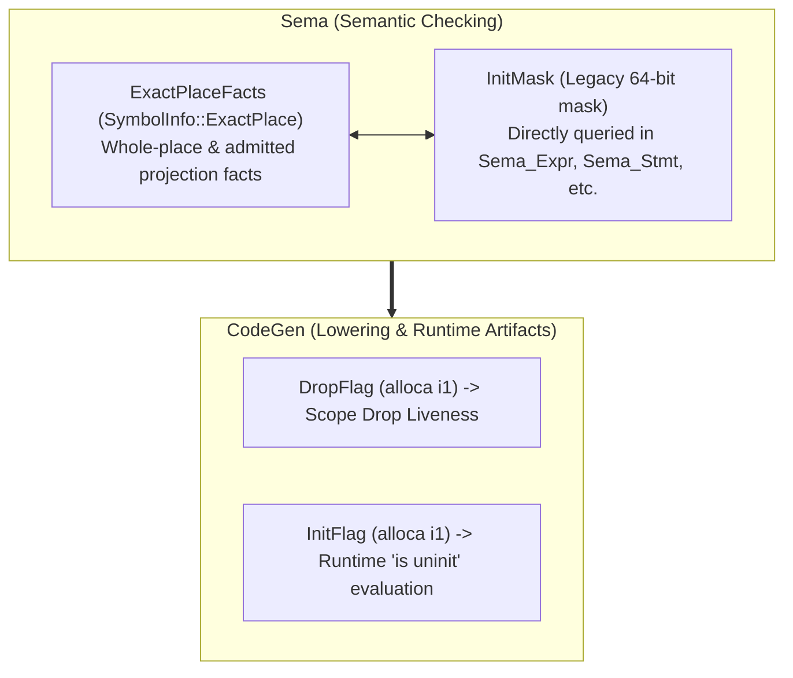

# Init Completeness Audit (Layer 1 Reliability & Soundness)

**Status:** Preliminary baseline audit. No P0 soundness defect was found in
the inspected P1 paths, but proof remains incomplete while legacy InitMask
participates in semantic decisions and several matrix rows lack direct evidence.

---

## 1. Definition of "Completeness" & Audit Scope

Completeness of the Toka Initialization system is strictly partitioned into two
layers:

1. **Layer 1: Reliability and Soundness within the Declared P1 Boundary**
   Every program accepted by the compiler must guarantee:
   - No read of uninitialized storage;
   - No duplicate initialization of an already initialized place;
   - No application of `init` to a moved place;
   - No drop of never-constructed or moved-out storage;
   - Exact single drop of conditionally or fully constructed resources across
     all normal control-flow exits (normal fallthrough, explicit returns, and
     loop breaks; runtime panic/abort executes direct process termination
     without unwinding cleanup).

2. **Layer 2: Language Expressiveness Coverage**
   Capabilities not yet admitted into the core language (such as field-wise
   delayed init, async `init` formals, and method `init` receivers) are
   formally designated as **Deferred**. Their absence is an intentional scope
   boundary rather than a soundness defect.

This audit establishes the preliminary baseline, identifies the hybrid migration
state, and catalogues required verification evidence.

---

## 2. Feature Classification Boundary

| Category | Features Included |
|---|---|
| **Implemented (P1 Core)** | `auto x = uninit:T`<br>`init x = expr`<br>Lexical `init x { ... }`<br>`if x is uninit { ... }` predicate<br>Synchronous plain `init` function formals<br>Control flow merges (`if`/`guard`/`match`/`loop`/`break`/`continue`/`return`)<br>Dynamic runtime `DropFlag` / `InitFlag` lowering |
| **Implemented (G17 Outcome)** | `outcomes:`-dependent post-states (`Ok => out: init`, `Err => out: uninit`) at Level-A exhaustive matching |
| **Deferred** | Field-wise delayed init (`init x.field = ...`)<br>Async `init` formals (`async fn ... (init x: T)`)<br>Callable/method receiver `init` formals<br>Projections/slices in `init` formal actuals<br>Compound boolean predicates on `is uninit` |
| **Explicitly Rejected** | Bare `auto x = uninit` without type annotation<br>`init` on `Moved` or `Live` place (`ERR_INIT_REQUIRES_UNINITIALIZED`)<br>Ordinary assignment to uninitialized binding (`ERR_INIT_REQUIRES_EXPLICIT`)<br>Unresolved `init` obligations crossing `.await`<br>Non-local escape of `is uninit` |

> [!NOTE]
> **Document Drift Rectification**: [`init_contract_rfc.md`](init_contract_rfc.md)
> originally marked "outcome-dependent contracts remain deferred". The codebase
> has since implemented and verified G17 Outcome Contracts ([`outcome_contract_rfc.md`](outcome_contract_rfc.md))
> at Level A. This audit confirms that G17 integrates with `PlaceState` without
> defining an alternate state model.

---

## 3. Deep-Dive Audit of Five Critical Risk Areas

### Risk Area 1: State System Coexistence & Hybrid Migration



- **Current Reality: Hybrid System**: While `PlaceState` (via `ExactPlaceFacts`)
  governs whole-place `Never`/`Live`/`Moved` state transitions and `init`
  preconditions, legacy `InitMask` is **not purely a derived projection**. It
  still actively participates in semantic decisions across the compiler:
  - `Sema_Expr.cpp`: queries `InitMask` to determine aggregate read legality;
  - `Sema_Expr_Member.cpp`: inspects individual bits to determine field initialization;
  - `Sema_Expr_Binary.cpp`: checks `InitMask` for uninitialized fields and LHS writability;
  - `Sema_Stmt.cpp`: evaluates `DirtyReferentMask` / `InitMask` to check whether dirty references may escape scope;
  - Multiple control flow merges (`if`, `match`, `loop`) independently merge `InitMask` alongside `ExactPlaces`.
- **Soundness Impact**: While no divergence between `PlaceState` and `InitMask`
  was observed in inspected paths, the coexistence of two active decision
  surfaces means `PlaceState` cannot yet be proclaimed the sole semantic source of truth.
- **CodeGen Lowering**: `InitFlag` and `DropFlag` are LLVM `alloca` instances
  generated during lowering. They execute the runtime branch checks and cleanup
  dispatches without performing compile-time contract checking.

**Verdict: Hybrid / migration incomplete.** A full migration roadmap to retire
autonomous `InitMask` decision paths is required.

---

### Risk Area 2: Control Flow Merging & Join Invariants

- **State Join Operator**: `ExactPlaceFacts::operator|=` unions reachable states:
  $$\text{Fact}_{\text{merged}} = \bigcup_{i} \text{Fact}_{\text{branch } i}$$
- **Safety Invariant**:
  If any reachable path leaves a place $x$ as `Never`, the merged fact satisfies
  $\text{hasPlaceState}(\text{merged}, \text{Never}) = \text{true}$ and
  $\text{hasExactlyPlaceState}(\text{merged}, \text{Live}) = \text{false}$.
- **Inspected Behaviors**:
  1. **Reads/Moves**: Rejected because reads require definite `Live`
     (`hasExactlyPlaceState(..., Live)`).
  2. **Subsequent `init`**: Rejected because `init` requires definite `Never`
     (`hasExactlyPlaceState(..., Never)`).
  3. **Lexical `init x { ... }` Exit**: Checked with `hasExactlyPlaceState(..., Live)`.
     If any path failed to construct $x$, `ERR_INIT_BLOCK_UNFULFILLED` is emitted.
  4. **Loops & Breaks**: Loop back-edges and labelled breaks join facts into the
     loop exit state; zero-trip loops retain entry `Never` in the union.
  5. **Divergence**: Diverging paths (`return`, `never`) are pruned from
     the fallthrough join via `allPathsJump` / `allPathsReturn`.

**Verdict: Inspected & Tested (targeted adversarial suite needed).**

---

### Risk Area 3: Three-Way State Transitions (`Never`, `Live`, `Moved`)

```text
         +------------------ init ----------------->+
         |                                          |
         v                                          |
     [ Never ]                                  [ Live ] <------+
         |                                          |           |
         | (ERR_INIT_REQUIRES_UNINITIALIZED)        |           |
         x                                          | cede      | ordinary
         |                                          v           | repopulation
         +------------------------------------> [ Moved ] ------+
```

1. `Never --init--> Live`: Admitted only when `placeFact()` is exactly `Never`.
   Consumes `InitAuthority` and transitions to `Live`.
2. `Live --cede--> Moved`: Moves ownership out of the place. Place remains
   allocated but unavailable.
3. `Moved --init--> X`: **Statically rejected** by `hasExactlyPlaceState(..., Never)`.
   *(Requires dedicated test case to complete evidence chain).*
4. `Moved --ordinary assignment--> Live`: Admitted for mutable bindings.
   Sets `InitMask = ~0ULL` and marks `DropFlag = true`.
   CodeGen inspects `DropFlag` prior to assignment; because `DropFlag`
   was reset to `false` upon move, no phantom old value is dropped.
   *(Requires dedicated whole-place drop-counter test).*

**Verdict: Inspected (evidence gaps identified in INIT-05 and INIT-20).**

---

### Risk Area 4: Destruction & Runtime Flag Synchronization

| Scenario | Compile-Time State | Runtime `DropFlag` | Destruction Behavior |
|---|---|---|---|
| Never initialized | `Never` | `false` | 0 drops on scope exit |
| Unconditionally initialized | `Live` | `true` | Exactly 1 drop on scope exit |
| Branch conditionally initialized | `{Never, Live}` | `true` on init branch, `false` otherwise | Dynamic conditional drop |
| Initialized then ceded | `Moved` | Cleared to `false` at cede site | 0 drops on scope exit |
| Ceded then repopulated | `Live` | Reset to `true` at assignment | Exactly 1 drop on scope exit |
| Aggregate partial move | `Live` (masked) | `DropMask` updated per field | Masked drop cascade; no double drop |

- **Runtime Panic**: Toka runtime invokes `abort` on POSIX and `ExitProcess` on
  Windows; panic paths do not execute unwinding cleanup.

**Verdict: Inspected & Tested on existing fixtures.**

---

### Risk Area 5: ABI & Source-Less Replay

- **ABI Representation**: `init` formal parameters are lowered to pass-by-reference
  (`T*` in LLVM IR) without caller-side value copy or callee-side drop ownership.
- **TKI Serialization**: `CanonicalDeclarationWitness` and `SemanticManifestEnvelope`
  encode `IsInit` (`\1` / `\0`) in the parameter stream.
- **Source-Less Replay**: Deserialization into `FunctionDecl` reconstructs the
  identical `PlaceState::Never` initial condition and enforces callee-side
  `PlaceState::Live` fulfillment on retained generic and non-generic bodies.

**Verdict: Tested.**

---

## 4. Init Completeness Matrix

| ID | Feature / Invariant | Status | Classification | Evidence / Test |
|---|---|---|---|---|
| **INIT-01** | `auto x = uninit:T` establishes typed `Never` place | **Tested** | Implemented | `tests/pass/g04_scratch_uninit.tk` |
| **INIT-02** | `init x = expr` constructs `Never -> Live` on plain immutable local | **Tested** | Implemented | `tests/pass/g16_init_direct_local_test.tk` |
| **INIT-03** | Ordinary assign to `Never` rejected (`ERR_INIT_REQUIRES_EXPLICIT`) | **Tested** | Implemented | `tests/fail/g16_init_requires_explicit.tk` |
| **INIT-04** | Duplicate `init` on `Live` rejected (`ERR_INIT_REQUIRES_UNINITIALIZED`) | **Tested** | Implemented | `tests/fail/g16_init_repeated_local.tk` |
| **INIT-05** | `init` on `Moved` rejected (`ERR_INIT_REQUIRES_UNINITIALIZED`) | **Tested** | Implemented | `tests/fail/g16_init_moved_rejected.tk` |
| **INIT-06** | Lexical `init x { ... }` block requires entry `Never` | **Tested** | Implemented | `tests/pass/g16_init_lexical_block_test.tk` |
| **INIT-07** | Lexical `init x { ... }` unfulfilled exit rejected | **Tested** | Implemented | `tests/fail/g16_init_block_unfulfilled.tk` |
| **INIT-08** | Lexical `init` early `break`/`continue` escape rejected | **Tested** | Implemented | `tests/fail/g16_init_block_exit.tk`<br>`tests/fail/g16_init_block_continue_exit.tk`<br>`tests/fail/g16_init_block_labelled_break.tk`<br>`tests/fail/g16_init_block_labelled_continue.tk` |
| **INIT-09** | `if x is uninit` predicate narrows branches (`Never` / `Live`) | **Tested** | Implemented | `tests/pass/g16_init_state_predicate_test.tk` |
| **INIT-10** | `is uninit` outside lexical block or non-maybe rejected | **Tested** | Implemented | `tests/fail/g16_init_state_predicate_outside.tk` |
| **INIT-11** | Synchronous plain `init` formal parameter contract | **Tested** | Implemented | `tests/pass/g16_init_parameter_test.tk` |
| **INIT-12** | `init` formal unfulfilled on fallthrough/return rejected | **Tested** | Implemented | `tests/fail/g16_init_parameter_unfulfilled.tk`<br>`tests/fail/g16_init_parameter_return_unfulfilled.tk` |
| **INIT-13** | `init` formal passing non-`Never` actual rejected | **Tested** | Implemented | `tests/fail/g16_init_parameter_invalid_argument.tk` |
| **INIT-14** | `init` formal in `async fn` rejected | **Tested** | Implemented | `tests/fail/g16_init_parameter_async.tk` |
| **INIT-15** | Unresolved lexical `init` obligation across `.await` rejected | **Tested** | Implemented | `tests/fail/g16_init_block_await_unresolved.tk` |
| **INIT-16** | G17 Outcome Contract conditional `init`/`uninit` post-states | **Tested** | Implemented (Level A) | `tests/semantics/tki_replay/cases/outcome_001_direct_match/` |
| **INIT-17** | Generic function `init` formal and TKI roundtrip | **Tested** | Implemented | `tests/semantics/tki_replay/cases/init_002_parameter/`<br>`tests/pass/g16_init_parameter_generic_test.tk` |
| **INIT-18** | Zero runtime drop on never-initialized resource | **Tested** | Implemented | `tests/pass/g16_init_cleanup_liveness_test.tk` |
| **INIT-19** | Dynamic drop flag cleanup on branch-initialized resource | **Tested** | Implemented | `tests/pass/g16_init_cleanup_liveness_test.tk` |
| **INIT-20** | Repopulating moved resource drops only new value | **Tested** | Implemented | `tests/conformance/ownership/moved_whole_place_repopulate_lifecycle.tk` |
| **INIT-21** | Field-wise delayed initialization (`init x.field = ...`) | **Deferred** | Deferred (P2) | Scope boundary |
| **INIT-22** | Async `init` formal parameter | **Deferred** | Deferred (P2) | Scope boundary |
| **INIT-23** | Method receiver `init self` | **Deferred** | Deferred (P2) | Scope boundary |
| **INIT-24** | Ordinary borrow/projection cannot transport InitAuthority | **Tested** | P1 Boundary Invariant | `tests/fail/init_uninit_shape_direct_field_assign.tk`<br>`tests/fail/init_uninit_scalar_borrow.tk`<br>`tests/fail/init_uninit_shape_borrow.tk`<br>`tests/fail/init_custom_drop_reference_sibling_read.tk`<br>`tests/fail/init_custom_drop_reference_full_write.tk`<br>`tests/fail/init_shared_member_reference_partial_init.tk`<br>`tests/fail/init_uninit_array_index_assign.tk` |

---

## 5. Audit Findings & Summary

- **Confirmed P0 bugs**: **0 active** (1 remediated: ordinary reference/projection writes fail-closed rejected on non-Live roots).
- **Unproven soundness claims**: `InitMask` / `ExactPlace` equivalence in hybrid semantic checking.
- **Deferred expressiveness**: field-wise and async init contracts (`INIT-21`, `INIT-22`, `INIT-23`).
- **Action Items for Completeness Proof & P0 Remediation**:
  1. ~~Fail-closed: Prevent ordinary reference creation from non-Live places~~ (*Closed*);
  2. ~~Fail-closed: Reject ordinary member/index assignments on Never whole places~~ (*Closed*);
  3. ~~Close P0 regression matrix across custom-drop, shared-member, and array forms~~ (*Closed*);
  4. Develop the migration plan to retire autonomous `InitMask` semantic decision paths.
