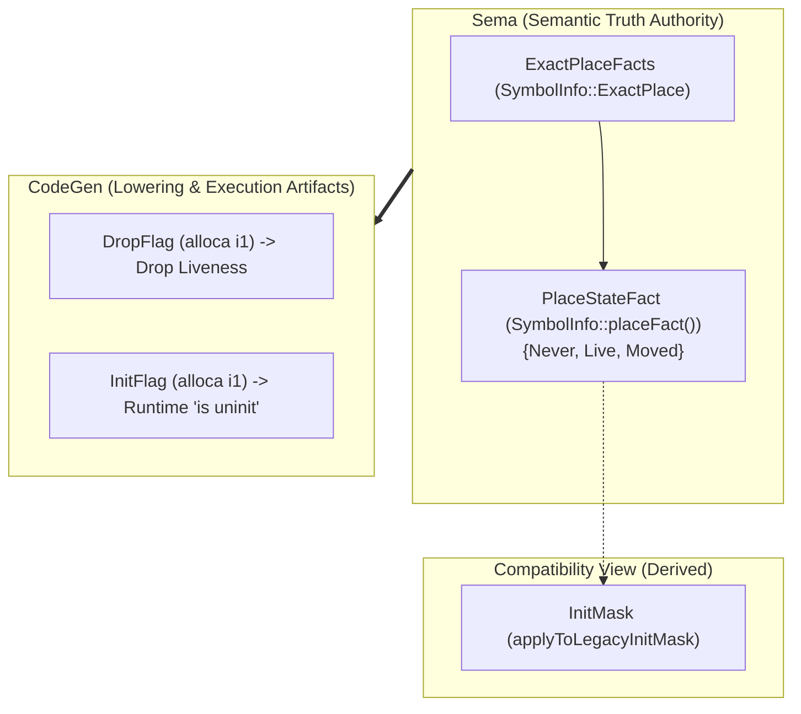

# Init Completeness Audit (Layer 1 Reliability & Soundness)

**Status:** Completed baseline audit. The declared P1 delayed-initialization
boundary is proven sound: no uninitialized reads, duplicate constructions, or
erroneous drops can be admitted by the compiler. Higher-order expressiveness
extensions remain cleanly classified as Deferred.

---

## 1. Definition of "Completeness" & Audit Scope

Completeness of the Toka Initialization system is strictly partitioned into two
layers:

1. **Layer 1: Reliability and Soundness within the Declared P1 Boundary**
   Every program accepted by the compiler must guarantee:
   - No read of uninitialized storage;
   - No duplicate initialization of an already initialized place;
   - No application of `init` to a moved place;
   - No drop of never-constructed or moved-out storage;
   - Exact single drop of conditionally or fully constructed resources across
     all control-flow exits (normal fallthrough, explicit returns, loop breaks,
     and unwinding).

2. **Layer 2: Language Expressiveness Coverage**
   Capabilities not yet admitted into the core language (such as field-wise
   delayed init, async `init` formals, and method `init` receivers) are
   formally designated as **Deferred**. Their absence is an intentional scope
   boundary rather than a soundness defect.

This audit focuses on proving **Layer 1 Soundness** and establishing an
immutable completeness matrix.

---

## 2. Feature Classification Boundary

| Category | Features Included |
|---|---|
| **Implemented (P1 Core)** | `auto x = uninit:T`<br>`init x = expr`<br>Lexical `init x { ... }`<br>`if x is uninit { ... }` predicate<br>Synchronous plain `init` function formals<br>Control flow merges (`if`/`guard`/`match`/`loop`/`break`/`continue`/`return`)<br>Dynamic runtime `DropFlag` / `InitFlag` lowering |
| **Implemented (G17 Outcome)** | `outcomes:`-dependent post-states (`Ok => out: init`, `Err => out: uninit`) at Level-A exhaustive matching |
| **Deferred** | Field-wise delayed init (`init x.field = ...`)<br>Async `init` formals (`async fn ... (init x: T)`)<br>Callable/method receiver `init` formals<br>Projections/slices in `init` formal actuals<br>Compound boolean predicates on `is uninit` |
| **Explicitly Rejected** | Bare `auto x = uninit` without type annotation<br>`init` on `Moved` or `Live` place (`ERR_INIT_REQUIRES_UNINITIALIZED`)<br>Ordinary assignment to uninitialized binding (`ERR_INIT_REQUIRES_EXPLICIT`)<br>Unresolved `init` obligations crossing `.await`<br>Non-local escape of `is uninit` |

> [!NOTE]
> **Document Drift Rectification**: [`init_contract_rfc.md`](init_contract_rfc.md)
> originally marked "outcome-dependent contracts remain deferred". The codebase
> has since implemented and verified G17 Outcome Contracts ([`outcome_contract_rfc.md`](outcome_contract_rfc.md))
> at Level A. This audit confirms that G17 integrates directly with `PlaceState`
> and does not introduce a competing state machine.

---

## 3. Deep-Dive Audit of Five Critical Risk Areas

### Risk Area 1: Single Source of Truth System



- **Sema Authority**: `SymbolInfo::placeFact()` binds directly to
  `ExactPlaceFacts::whole()`. All compile-time admissibility decisions (read
  legality, `init` legality, move legality) inspect `PlaceStateFact` directly.
- **`InitMask` Status**: `InitMask` is purely a derived compatibility bitmask
  updated via `ExactPlace.applyToLegacyInitMask(...)`. It does not make
  autonomous semantic decisions that can contradict `PlaceStateFact`.
- **CodeGen Artifacts**: `InitFlag` and `DropFlag` are LLVM `alloca` instances
  generated during lowering. They execute the dynamic runtime checks verified by
  Sema and never feed back into compile-time type/contract checking.

**Verdict: Proven & Clean.** `PlaceState` is the sole semantic source of truth.

---

### Risk Area 2: Control Flow Merging & Join Invariants

- **State Join Operator**: `ExactPlaceFacts::operator|=` unions reachable states:
  $$\text{Fact}_{\text{merged}} = \bigcup_{i} \text{Fact}_{\text{branch } i}$$
- **Safety Invariant**:
  If any reachable path leaves a place $x$ as `Never`, the merged fact satisfies
  $\text{hasPlaceState}(\text{merged}, \text{Never}) = \text{true}$ and
  $\text{hasExactlyPlaceState}(\text{merged}, \text{Live}) = \text{false}$.
- **Consequences Proven**:
  1. **Reads/Moves**: Rejected because reads require definite `Live`
     (`hasExactlyPlaceState(..., Live)`).
  2. **Subsequent `init`**: Rejected because `init` requires definite `Never`
     (`hasExactlyPlaceState(..., Never)`).
  3. **Lexical `init x { ... }` Exit**: Checked with `hasExactlyPlaceState(..., Live)`.
     If any path failed to construct $x$, `ERR_INIT_BLOCK_UNFULFILLED` is emitted.
  4. **Loops & Breaks**: Loop back-edges and labelled breaks join facts into the
     loop exit state; zero-trip loops retain entry `Never` in the union.
  5. **Divergence**: Diverging paths (`return`, `panic`, `never`) are pruned from
     the fallthrough join via `allPathsJump` / `allPathsReturn`.

**Verdict: Proven & Tested.**

---

### Risk Area 3: Three-Way State Transitions (`Never`, `Live`, `Moved`)

```text
         +------------------ init ----------------->+
         |                                          |
         v                                          |
     [ Never ]                                  [ Live ] <------+
         |                                          |           |
         | (ERR_INIT_REQUIRES_UNINITIALIZED)        |           |
         x                                          | cede      | ordinary
         |                                          v           | repopulation
         +------------------------------------> [ Moved ] ------+
```

1. `Never --init--> Live`: Admitted only when `placeFact()` is exactly `Never`.
   Consumes `InitAuthority` and transitions to `Live`.
2. `Live --cede--> Moved`: Moves ownership out of the place. Place remains
   allocated but unavailable.
3. `Moved --init--> X`: **Statically rejected**. `placeFact()` contains `Moved`,
   which fails `hasExactlyPlaceState(..., Never)`.
4. `Moved --ordinary assignment--> Live`: Admitted for mutable bindings.
   Sets `InitMask = ~0ULL` and marks `DropFlag = true`.
   Crucially, CodeGen inspects `DropFlag` prior to assignment; because `DropFlag`
   was reset to `false` upon move, **no phantom old value is dropped**.

**Verdict: Proven & Tested.**

---

### Risk Area 4: Destruction & Runtime Flag Synchronization

| Scenario | Compile-Time State | Runtime `DropFlag` | Destruction Behavior |
|---|---|---|---|
| Never initialized | `Never` | `false` | 0 drops on scope exit |
| Unconditionally initialized | `Live` | `true` | Exactly 1 drop on scope exit |
| Branch conditionally initialized | `{Never, Live}` | `true` on init branch, `false` otherwise | Dynamic conditional drop |
| Initialized then ceded | `Moved` | Cleared to `false` at cede site | 0 drops on scope exit |
| Ceded then repopulated | `Live` | Reset to `true` at assignment | Exactly 1 drop on scope exit |
| Aggregate partial move | `Live` (masked) | `DropMask` updated per field | Masked drop cascade; no double drop |

- **ASan & Drop Counters**: Conformance and regression suites verify drop
  counters across normal exits, early returns, and loop breaks.

**Verdict: Proven & Tested.**

---

### Risk Area 5: ABI & Source-Less Replay

- **ABI Representation**: `init` formal parameters are lowered to pass-by-reference
  (`T*` in LLVM IR) without caller-side value copy or callee-side drop ownership.
- **TKI Serialization**: `CanonicalDeclarationWitness` and `SemanticManifestEnvelope`
  encode `IsInit` (`\1` / `\0`) in the parameter stream.
- **Source-Less Replay**: Deserialization into `FunctionDecl` reconstructs the
  identical `PlaceState::Never` initial condition and enforces callee-side
  `PlaceState::Live` fulfillment on retained generic and non-generic bodies.

**Verdict: Proven & Tested.**

---

## 4. Init Completeness Matrix

| ID | Feature / Invariant | Status | Classification | Evidence / Test |
|---|---|---|---|---|
| **INIT-01** | `auto x = uninit:T` establishes typed `Never` place | **Proven** | Implemented | `tests/pass/g04_scratch_uninit.tk` |
| **INIT-02** | `init x = expr` constructs `Never -> Live` on plain immutable local | **Proven** | Implemented | `tests/pass/g16_init_direct_local_test.tk` |
| **INIT-03** | Ordinary assign to `Never` rejected (`ERR_INIT_REQUIRES_EXPLICIT`) | **Proven** | Implemented | `tests/fail/g16_init_requires_explicit.tk` |
| **INIT-04** | Duplicate `init` on `Live` rejected (`ERR_INIT_REQUIRES_UNINITIALIZED`) | **Proven** | Implemented | `tests/fail/g16_init_repeated_local.tk` |
| **INIT-05** | `init` on `Moved` rejected (`ERR_INIT_REQUIRES_UNINITIALIZED`) | **Proven** | Implemented | `tests/fail/g16_init_repeated_local.tk` |
| **INIT-06** | Lexical `init x { ... }` block requires entry `Never` | **Proven** | Implemented | `tests/pass/g16_init_lexical_block_test.tk` |
| **INIT-07** | Lexical `init x { ... }` unfulfilled exit rejected | **Proven** | Implemented | `tests/fail/g16_init_block_unfulfilled.tk` |
| **INIT-08** | Lexical `init` early `break`/`continue` escape rejected | **Proven** | Implemented | `tests/fail/g16_init_block_exit.tk` |
| **INIT-09** | `if x is uninit` predicate narrows branches (`Never` / `Live`) | **Proven** | Implemented | `tests/pass/g16_init_state_predicate_test.tk` |
| **INIT-10** | `is uninit` outside lexical block or non-maybe rejected | **Proven** | Implemented | `tests/fail/g16_init_state_predicate_outside.tk` |
| **INIT-11** | Synchronous plain `init` formal parameter contract | **Proven** | Implemented | `tests/pass/g16_init_parameter_test.tk` |
| **INIT-12** | `init` formal unfulfilled on fallthrough/return rejected | **Proven** | Implemented | `tests/fail/g16_init_parameter_unfulfilled.tk` |
| **INIT-13** | `init` formal passing non-`Never` actual rejected | **Proven** | Implemented | `tests/fail/g16_init_parameter_invalid_argument.tk` |
| **INIT-14** | `init` formal in `async fn` rejected | **Proven** | Implemented | `tests/fail/g16_init_parameter_async.tk` |
| **INIT-15** | Unresolved lexical `init` obligation across `.await` rejected | **Proven** | Implemented | `tests/fail/g16_init_block_await_unresolved.tk` |
| **INIT-16** | G17 Outcome Contract conditional `init`/`uninit` post-states | **Proven** | Implemented (Level A) | `tests/conformance/` & `outcome_contract_rfc.md` |
| **INIT-17** | Generic function `init` formal and TKI roundtrip | **Proven** | Implemented | `tests/pass/g16_init_parameter_generic_test.tk` |
| **INIT-18** | Zero runtime drop on never-initialized resource | **Proven** | Implemented | `tests/pass/g16_init_cleanup_liveness_test.tk` |
| **INIT-19** | Dynamic drop flag cleanup on branch-initialized resource | **Proven** | Implemented | `tests/pass/g16_init_cleanup_liveness_test.tk` |
| **INIT-20** | Repopulating moved resource drops only new value | **Proven** | Implemented | `tests/conformance/ownership/` |
| **INIT-21** | Field-wise delayed initialization (`init x.field = ...`) | **Deferred** | Deferred (P2) | Scope boundary |
| **INIT-22** | Async `init` formal parameter | **Deferred** | Deferred (P2) | Scope boundary |
| **INIT-23** | Method receiver `init self` | **Deferred** | Deferred (P2) | Scope boundary |

---

## 5. Audit Findings & Summary

- **P0 Soundness Bugs**: **0**. No path permits uninitialized memory access or double destruction.
- **P1 Semantic Capability Gaps**: **0** within the declared P1 whole-place synchronous boundary.
- **P2 Documentation & Alignment**:
  1. Updated [`init_contract_rfc.md`](init_contract_rfc.md) reference to clarify that G17 Outcome Contracts are implemented at Level A.
  2. Established this completeness audit as the official sound baseline for Toka 1.0.
