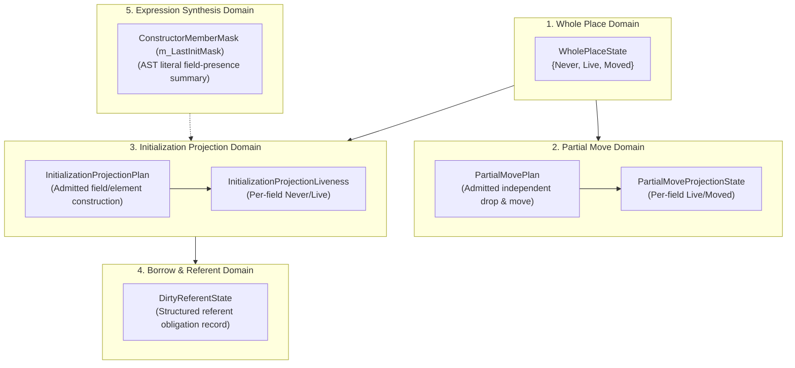

# Init & Projection Fact Tracking Requirements

**Status:** Design Specification & Requirements Document.

---

## 1. Executive Summary & Design Challenge

In the current Toka compiler, `ExactPlaceFacts::projectionFact()` is directly
coupled to `PartialMovePlan`. While `PartialMovePlan` governs partial moves and
masked destruction, its admissibility criteria intentionally exclude:
- Custom-drop shapes (`@Encap` implementation);
- Shared member shapes (`~T` or shared fields);
- Non-struct/tuple types;
- Aggregate types with more than 64 fields;
- Dynamic array indexing.

Field initialization and read-availability checking, however, have fundamentally
distinct semantic obligations. For example:
- A custom-drop shape **must** track field initialization during construction,
  even though it can never be partially moved once constructed;
- A struct containing shared members must track that each field is initialized
  before the aggregate is read;
- A reference borrowing an incomplete aggregate must track which specific fields
  are dirty without being artificially constrained to a 64-bit integer.

This specification formalizes the separation of five distinct state domains and
defines the architectural requirements for transitioning away from legacy
`InitMask`.

---

## 2. Five Distinct State Domains



### 2.1 Domain Definitions

1. **`WholePlaceState` (`PlaceStateFact`)**:
   - Governs the root storage binding (`Never`, `Live`, `Moved`).
   - Authority for delayed-init whole variables, synchronous `init` formals,
     and whole-place destruction.
2. **`PartialMoveProjectionState`**:
   - Governs places whose subfields can be independently moved out (`cede x.field`).
   - Strictly requires that the type has no custom destructor, has no shared
     members, and has a static layout.
3. **`InitializationProjectionLiveness`**:
   - Governs the step-by-step construction of fields within an aggregate place.
   - Applies to **all** constructible aggregates (including custom-drop shapes and
     shared-member aggregates) prior to whole-place availability.
4. **`DirtyReferentState`**:
   - Tracks whether an `&mut` reference to an incomplete aggregate has fulfilled
     its initialization obligation before the reference exits scope or is returned.
5. **`ConstructorMemberMask` (`m_LastInitMask`)**:
   - A transient, expression-level AST evaluation artifact.
   - Summarizes which fields were supplied in a literal constructor expression.
   - Strictly isolated from place fact storage.

---

## 3. Core Architectural Decisions

### Decision 1: Separation of `PartialMovePlan` and `InitializationProjectionPlan`
- **Decision**: `PartialMovePlan` and `InitializationProjectionPlan` **must not**
  share a single admissibility filter.
- **Rationale**:
  - `PartialMovePlan` enforces destructor separability: if a type defines
    `impl T@Encap { fn drop(self#) }`, partial move is rejected because the
    custom drop function expects a coherent, complete instance.
  - `InitializationProjectionPlan` enforces construction completeness: a
    custom-drop shape requires every field to be initialized before it becomes
    `Live`. Tracking field initialization during construction is mandatory.

### Decision 2: Custom-Drop Shape Construction Model
- **During Construction (`Never` $\to$ `Live`)**:
  - The aggregate place starts with `WholePlaceState = Never` and all fields in
    `InitializationProjectionLiveness = Never`.
  - No custom destructor can run if construction is aborted or unwound.
- **Upon Completion**:
  - When all fields satisfy `Live`, the place transitions to `WholePlaceState = Live`.
  - Once `Live`, `PartialMovePlan` marks the place as non-separable (no partial
    moves permitted).
  - Scope exit invokes the custom drop function exactly once.

### Decision 3: Shared Members in Aggregate Places
- **Decision**: Shared members (`~T` or shared fields) participate in
  `InitializationProjectionPlan`, but remain excluded from `PartialMovePlan`.
- **Rationale**:
  - Initializing a shared field writes an established handle into the aggregate.
  - Ceding a shared field out of an aggregate is prohibited if it violates
    aggregate integrity, but constructing it field-by-field is valid.

### Decision 4: Handling Types with More Than 64 Fields
- **Decision**: Aggregates with $>64$ fields must not be truncated or silently
  aliased by a `uint64_t` bitmask.
- **Strategy**:
  - Small aggregates ($\le 64$ fields) use compact inline bitmaps.
  - Large aggregates ($>64$ fields) use dynamically sized or spilled fact
    vectors within `ExactPlaceFacts`.

### Decision 5: Dynamic Array Indexing
- **Decision**: Dynamic array indexing (`arr[i]` where `i` is a runtime variable)
  cannot statically prove individual element initialization.
- **Strategy**:
  - Arrays must either be initialized as a whole (`[val; N]`, array literals),
    or constant indices must be individually verified.
  - Dynamic index access on an incompletely initialized array is statically
    rejected.

### Decision 6: Structured Referent Facts for References
- **Decision**: Replace `DirtyReferentMask` with a structured `ReferentAuthority`
  record on `SymbolInfo`.
- **Structure**:
  - `ReferentSourceSymbol`: Name / ID of borrowed place.
  - `RequiredInitProjections`: Set/bitmap of fields the borrow must initialize.
  - Scope exit checks that the source place's facts satisfy the required obligations.

### Decision 7: Confinement of `m_LastInitMask`
- **Decision**: `m_LastInitMask` is strictly confined to `Sema_Expr_Init.cpp`
  literal synthesis.
- **Rule**: No statement-level checking code (in `Sema_Stmt.cpp`, `Sema_Expr.cpp`,
  or `Sema_Expr_Binary.cpp`) may query `m_LastInitMask` to determine place
  legality or drop liveness.

---

## 4. Phase-Gated Transition Strategy

```text
+-----------------------------------------------------------------------------+
| Phase 3.0: Verification & Consistency Assertion                             |
| - Add debug assertions verifying ExactPlace == InitMask on plain locals.    |
+-----------------------------------------------------------------------------+
                                      |
                                      v
+-----------------------------------------------------------------------------+
| Phase 3.1: Plain Local Class A Migration                                    |
| - Remove InitMask fallbacks on plain scalars.                               |
+-----------------------------------------------------------------------------+
                                      |
                                      v
+-----------------------------------------------------------------------------+
| Phase 3.2: Formalize InitializationProjectionPlan                           |
| - Introduce InitializationProjectionPlan alongside PartialMovePlan.         |
| - Unify field/index projection reads and writes under ExactPlace.           |
+-----------------------------------------------------------------------------+
                                      |
                                      v
+-----------------------------------------------------------------------------+
| Phase 3.3: Structured Referent Authority (Class C)                          |
| - Replace DirtyReferentMask with ReferentAuthority.                         |
+-----------------------------------------------------------------------------+
                                      |
                                      v
+-----------------------------------------------------------------------------+
| Phase 3.4: Retire AnalysisState::InitMasks                                  |
| - Remove InitMask branch merging from Sema_Expr.cpp.                        |
+-----------------------------------------------------------------------------+
```
