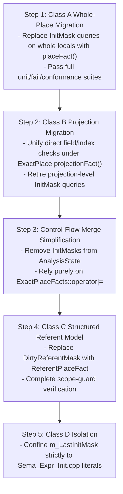

# InitMask Migration Ledger

**Status:** Active Inventory. This document catalogs every usage, mutation,
and control-flow merge of legacy `InitMask`, `DirtyReferentMask`, and
`m_LastInitMask` across Toka Semantic Analysis (`src/Sema/`). It defines the
exact migration classification, equivalent `ExactPlaceFacts` APIs, semantic
risks, and test prerequisites required to transition Toka from its current
hybrid state to an `ExactPlace`-only authority.

---

## 1. Migration Classification Taxonomy

| Class | Category | Target Authority / Strategy | Priority |
|---|---|---|---|
| **Class A** | **Whole-Place Semantic Decisions** | Migrate directly to `SymbolInfo::placeFact()` (`PlaceStateFact`) and `ExactPlaceFacts::isDefinitelyLive()`. | **P1 (Immediate)** |
| **Class B** | **Admitted Field / Index Projections** | Migrate directly to `ExactPlaceFacts::projectionFact(kind, bit)` governed by `PartialMovePlan`. | **P1 (Immediate)** |
| **Class C** | **Dirty Reference Referent State** | Migrate `DirtyReferentMask` to structured referent facts / borrow authority model. Cannot be mechanically removed without referent fact model. | **P2 (Design Needed)** |
| **Class D** | **Initializer Synthesis & Legacy Expressions** | Retain `m_LastInitMask` as an expression-level constructor synthesis helper, but isolate it from delayed-init and drop-obligation truth. | **P3 (Retained Helper)** |

---

## 2. Exhaustive Decision & Mutation Site Inventory

### 2.1 Class A: Whole-Place Semantic Decisions

| Location | Operation | Current Decision / Role | ExactPlace Equivalent | Risk / Divergence | Required Tests | Status |
|---|---|---|---|---|---|---|
| `Sema_Expr.cpp:1954` | Read | Checks `Info.InitMask == 0` for non-shape/non-array uninitialized read rejection | `!Info.ExactPlace.isDefinitelyLive()` or `hasPlaceState(Info.placeFact(), PlaceState::Never)` | `InitMask` can disagree with `PlaceState` if modified out-of-band | `tests/fail/g07_uninitialized_var_use.tk` | Pending |
| `Sema_Expr_Binary.cpp:728-730` | Read | Checks `InfoPtr->InitMask != ~0ULL` to grant `isLHSWritable` for uninitialized immutable local | `hasPlaceState(InfoPtr->placeFact(), PlaceState::Never)` | Mask may allow assignment on moved/dirty slots | `tests/fail/g16_init_requires_explicit.tk` `tests/fail/g16_init_moved_rejected.tk` | Pending |
| `Sema_Expr_Binary.cpp:1309` | Write | Sets `Info->InitMask = ~0ULL` on whole-place assignment | `Info->ExactPlace.transitionWhole(PlaceState::Never, PlaceState::Live)` / `setWhole(Live)` | Desynchronization between `InitMask` and `ExactPlace` | `tests/pass/g16_init_direct_local_test.tk` | Pending |
| `Sema_Stmt.cpp:2068` | Write | Initializes `Info.InitMask` during variable declaration | `Info.ExactPlace.setWhole(...)` | Declaration-side divergence on `uninit:T` vs default initializers | `tests/pass/g04_scratch_uninit.tk` | Pending |

### 2.2 Class B: Admitted Direct Field & Index Projections

| Location | Operation | Current Decision / Role | ExactPlace Equivalent | Risk / Divergence | Required Tests | Status |
|---|---|---|---|---|---|---|
| `Sema_Expr_Member.cpp:152-178` | Read | Checks `maskToCheck & (1ULL << i)` for field read availability when `!usesExactProjection` | `ExactPlace.projectionFact(DirectField, i)` | Non-admitted projections fall back to 64-bit mask | `tests/pass/g08_comprehensive.tk` `tests/conformance/ownership/` | Pending |
| `Sema_Expr_Member.cpp:567-573` | Read | Checks `Info->InitMask & (1ULL << constant)` for fixed array element availability | `ExactPlace.projectionFact(FixedArrayElement, idx)` | Index > 63 silent overflow; mask/fact divergence | `tests/conformance/ownership/cede_fixed_array_index_lifecycle.tk` | Pending |
| `Sema_Expr_Binary.cpp:874-876` | Read | Checks `!(EffectiveInfo->InitMask & bit)` for member LHS uninitialized writability | `!hasExactlyPlaceState(ExactPlace.projectionFact(DirectField, i), Live)` | Inconsistent writability permissions on aggregate members | `tests/pass/g08_comprehensive.tk` | Pending |
| `Sema_Expr_Binary.cpp:1360` | Write | `Info->InitMask |= bitsToSet` on member assignment | `ExactPlace.transitionProjection(DirectField, i, Live)` | Mask sets bit but `ExactPlace` projection fact not updated | `tests/conformance/ownership/cede_direct_field_reinitialize.tk` | Pending |
| `Sema_Expr_Binary.cpp:1386` | Write | `Info->InitMask |= (1ULL << constant)` on array index assignment | `ExactPlace.transitionProjection(FixedArrayElement, i, Live)` | Mask sets bit but `ExactPlace` projection fact not updated | `tests/conformance/ownership/cede_fixed_array_index_lifecycle.tk` | Pending |

### 2.3 Class C: Dirty Reference Referent State

| Location | Operation | Current Decision / Role | Target Structured Model | Risk / Divergence | Required Tests | Status |
|---|---|---|---|---|---|---|
| `Sema_Stmt.cpp:526-550` | Read | Checks `info.DirtyReferentMask != ~0ULL` and `(sourceInfo->InitMask & signature) != signature` at block scope exit | Structured Referent Fact / Borrow Obligation Record | Referent bitmask only supports up to 64 fields | `tests/fail/morphology_init_fail.tk` | Retained (C) |
| `Sema_Stmt.cpp:709-720` | Read | Checks `DirtyReferentMask != ~0ULL` at return statement exit | Structured Referent Fact / Return Contract | Dirty reference escaping via return undetected | `tests/fail/morphology_init_fail.tk` | Retained (C) |
| `Sema_Stmt.cpp:1907-1909` | Write | Sets `Info.DirtyReferentMask = srcPtr->InitMask` on reference declaration | Bind referent authority directly to source place | Mask propagation loses non-bitmask structure | `tests/pass/g04_destruct_match_comprehensive.tk` | Retained (C) |

### 2.4 Class D: Initializer Synthesis & Legacy Expressions

| Location | Operation | Current Decision / Role | Target Isolation Strategy | Risk / Divergence | Required Tests | Status |
|---|---|---|---|---|---|---|
| `Sema_Expr.cpp:1005, 1023, 1364` | Write | Resets `m_LastInitMask` before sub-expression evaluation | Expression-local constructor helper | None if isolated from statement-level fact authority | `tests/pass/g08_comprehensive.tk` | Retained (D) |
| `Sema_Expr_Init.cpp:1234-1530` | Read/Write | Computes aggregate literal member mask synthesis (`m_LastInitMask`) | Expression literal synthesizer | None if isolated from variable fact storage | `tests/pass/g08_comprehensive.tk` | Retained (D) |
| `Sema_Stmt.cpp:2063` | Read | Assigns `Info.InitMask = m_LastInitMask` on variable initialization | Direct `ExactPlace.setWhole(Live)` assignment | Coupling expression mask directly into place fact | `tests/pass/g08_comprehensive.tk` | Pending |

### 2.5 Control Flow State Snapshot & Merge Sites

| Location | Control Flow Construct | Current Merge Behavior | Migration Strategy |
|---|---|---|---|
| `Sema_Expr.cpp:627-785` | `AnalysisState` (`captureAnalysisState` / `mergeAnalysisStates`) | Simultaneously captures and merges `InitMasks` and `ExactPlaces` | Migrate all consumers of `InitMasks` to `ExactPlaces`, then retire `InitMasks` map |
| `Sema_Expr.cpp:2442-2616` | `if` / `else` / `is uninit` branch joins | Sets `Info->InitMask` based on `hasExactlyPlaceState(Live)` and merges `thenM & elseM` | Rely directly on `ExactPlaceFacts` join |
| `Sema_Expr.cpp:2723-2891` | `guard` statements | Captures `masksBefore` and applies `thenMask & elseMask` | Rely directly on `ExactPlaceFacts` join |
| `Sema_Expr.cpp:2977-3026` | `loop` statements | Merges `entryMask & bodyMask` | Rely directly on `ExactPlaceFacts` join |
| `Sema_Expr.cpp:3246-3410` | `match` expressions | Merges `masksBody & masksElse` | Rely directly on `ExactPlaceFacts` join |
| `Sema_Expr.cpp:5145-5158` | `for` loops | Restores `masksBefore` | Rely directly on `ExactPlaceFacts` join |

---

## 3. Step-by-Step Migration Roadmap

---

## 4. Verification Prerequisites

Before each migration step is executed, the following test suites must be executed:
1. `python3 tools/scripts/test_verify_fail.py` (671 fail tests);
2. `python3 tools/run_conformance.py` (299 conformance tests);
3. `bash tools/scripts/test_semantic_replay.sh` (12 semantic TKI replay cases);
4. `ctest --test-dir build --output-on-failure` (15 CTests).
