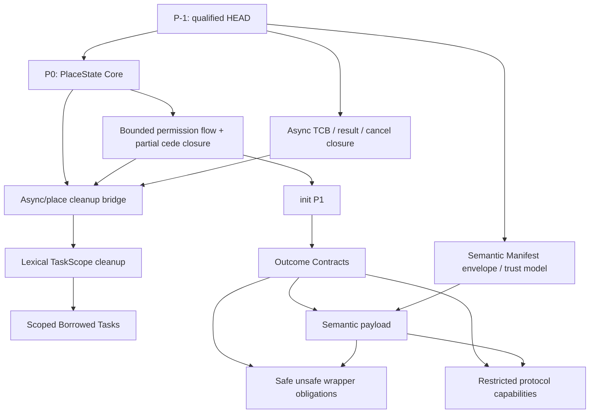

# RFC: Semantic Contract Evolution Roadmap

**Status:** Active planning baseline. It orders work but changes no source
syntax, TKI format, runtime, or compiler behaviour. Each linked RFC remains
normative only for the surface and maturity stated in that RFC.

**Purpose:** Order Toka's next semantic work so that explicit authority,
exact-place state, cleanup, async execution, and source-less interfaces share
one trustworthy model. This is a dependency and acceptance-gate RFC, not a
replacement for the individual language RFCs.

### Document authority

- `rule_matrix.md` and implementation-backed closure records describe frozen
  contracts plus evidence at their recorded revisions; they imply current-HEAD
  conformance only when a fresh gate explicitly binds that exact HEAD.
- This roadmap fixes dependency order and acceptance gates only.
- A feature-specific RFC freezes that feature's semantics only after its own
  status says so; a roadmap paragraph is not a substitute for such an RFC.
- The external Place--Authority--Obligation calculus route is a non-normative
  research probe. It may expose a bad factorization, but it does not change
  production language behavior without a separate RFC decision here.

## 1. North-star contract

Toka's differentiator is not another isolated ownership or effect feature. It
is the stronger claim that one exact-place contract does not lose meaning while
it crosses source control flow, function boundaries, cancellation/cleanup, and
source-less separate compilation:

```text
place state + declared authority + cleanup obligation
    agree in source, Sema, CodeGen, async runtime, TKI, and replay
```

The existing `@Encap`, H/P authority, PAL, `cede`, structured return contracts,
TypeSyntax, Unit/void/never separation, and TKI replay are the substrate for
this claim. New surface syntax must strengthen that substrate rather than
introduce a parallel informal model.

## 2. P-1: Re-qualify the current semantic baseline

No new semantic feature may begin implementation until the current HEAD is
again a qualified baseline.

The current release review is tied to an earlier commit and therefore cannot
by itself certify the present HEAD. A local audit of implementation revision
`fd3bf81d` reproduced a semantic-replay crash in a guard CodeGen path and a
TaskHandle-lifecycle crash in an await CodeGen path, while the focused Encap
Slice 5 and unsafe-TKI audits passed. P-1 begins from those red gates and must
record fresh results at the exact revision eventually qualified.

The requalification repair branch closes the two reproduced compiler crashes:
source-less guard reference payloads now lower from their resolved semantic
type, and Unit's `TaskHandle_M___` mangling is recovered as `()` before await
lowering. The focused TaskHandle lifecycle gate, including
`g11_async_p5_redline_test.tk`, now passes. This is current repair evidence,
not Phase-5/TCB conformance or a reason to mark the entire P-1 exit green.

Existing-destination source-invalidating transfer now performs a canonical
place-overlap preflight before RHS analysis can mark its source moved. It
rejects `cede` and direct `^` transfer with `E04615` for equal, ancestor,
descendant, and dynamic/unprovable paths; the latter remains fail-closed.
The narrow affine-index handoff retained by `Vec` is admitted only inside an
explicit `unsafe` container invariant, never as a safe-language alias proof.
The `permission_005_partial_cede_lifecycle` replay case exercises these
rejections source-backed and source-less, plus a disjoint existing-destination
transfer. This repairs that blocker but does not yet prove every lifecycle
combination in the P-1 exit gate.

The async closure review likewise found that the current standard-library
sequence `task_ref_from_handle(cede handle)` followed by `track_ref`/`start`
does not prove an atomic cold-handle handoff: ordinary consumed-handle drop can
race the later registry link/activation. The current TaskScope path and TCB
lifetime-reference model remain unqualified until the `AS` gates prove atomic
owning enrollment, result disposition, and TCB/slot retention independently of
frame eligibility.

### P-1 exit gate

1. Re-run the release-review, semantic replay, TaskHandle lifecycle, Encap
   Slice 5 TKI, unsafe TKI, and relevant pass/fail runners at the exact commit
   being qualified.
2. Repair every new crash, compiler assertion, source/TKI disagreement, or
   unsound acceptance exposed by that gate; record any unrelated quarantined
   failure with a reproducer and owner.
3. Record the exact qualified commit and one status ledger for every runner;
   historical release evidence must not be reported as current-HEAD evidence.
4. Demonstrate that a local skipped by `uninit` construction cannot receive a
   drop, while a live resource receives exactly one drop on each supported
   exit path.
5. Reject exact, ancestor, descendant, and unprovable canonical-place overlap
   for any source-invalidating move into an existing destination—including
   `cede` and direct unique moves—before either place or cleanup state changes;
   replay the same rule source-backed and source-less.
6. Record the exposed TaskScope/TaskRef helpers as unqualified until the async
   closure either replaces their split cold-enrollment path with one atomic
   consume-transfer-link-activate operation or removes that path from the safe
   surface; an existing `TaskRef` must also keep the TCB/slot alive after frame
   eligibility.

P-1 is complete only when these runners are green or their explicitly
quarantined exceptions are stable, justified, and unrelated to the semantic
core under change. P-1 repairs and qualifies existing behavior; it does not
quietly introduce the PlaceState redesign below.

## 3. P0: The PlaceState Core

`InitMask` and `Moved` are insufficient as unrelated flags when a later
contract must distinguish "never constructed" from "constructed then moved".
The internal ledger must model those facts separately for every supported exact
place.

The candidate production model to be frozen is defined by
[`place_state_core_rfc.md`](place_state_core_rfc.md). Its minimum
factorization is:

```text
ConstructionOrigin = NeverConstructed | Constructed
Availability       = Present | MovedOut
ConcretePlaceState = valid pairs of ConstructionOrigin x Availability
StaticPlaceFact    = a nonempty set of ConcretePlaceState
```

Only three concrete points are initially meaningful:

```text
(NeverConstructed, Present)
(Constructed, Present)
(Constructed, MovedOut)
```

`Maybe` is the specific static set used by delayed initialization, not a fourth
runtime construction state or a name for every uncertain state. The first
`init` slice uses the set
`{NeverConstructed/Present, Constructed/Present}` inside its lexical proof
block. `MovedOut` is not `NeverConstructed`, and it must never gain `init`
authority; ordinary repopulation after a move is a distinct transition.

The ledger's first rules are:

- direct `init` and an `init`-contract handoff require
  `NeverConstructed + Present`;
- ordinary reads, borrows, and moves require `Constructed + Present` plus the
  existing authority/PAL checks;
- ordinary replacement preserves `Constructed + Present`, while the bounded
  repopulation rule may restore `Constructed + MovedOut` without manufacturing
  first-construction authority;
- a state predicate may narrow only an active `Maybe` place inside its owning
  `init` block;
- the runtime drop mask follows `Constructed + Present` plus cleanup ownership,
  never merely allocated storage; and
- unsupported projection, custom-drop, dynamic-index, or async cases fail
  closed until their ledger and cleanup proof exists.

This is an internal representation and audit boundary. It adds no general
user-visible state machine on its own.

## 4. Ordered work



### 4.1 Bounded permission-flow and partial-`cede` closure

Complete the existing
[`permission_flow_two_mode_rfc.md`](permission_flow_two_mode_rfc.md) and
[`partial_cede_lifecycle_rfc.md`](partial_cede_lifecycle_rfc.md) by freezing
an implementation-backed capability matrix. Every accepted synchronous exact
projection must have aligned Sema authority, CodeGen drop-mask, TKI replay, and
diagnostics. Existing-destination transfer additionally requires a proven
canonical source/destination `Disjoint` relation; self- and prefix-overlap fail
closed rather than becoming an implicit no-op. Every unsupported nested,
dynamic, over-64, shared-sibling, or custom-drop combination must reject before lowering. Preserving those
projections across suspension or terminal cancellation is a separate
async/place bridge after both this closure and the async TCB are qualified.

This work intentionally closes a bounded model; it does not generalize every
projection form merely because a syntax can name it.

### 4.2 Delayed initialization P1

The [`init` RFC](init_contract_rfc.md) depends on PlaceState Core. P1 is
limited to whole stable local places, synchronous `init` contracts, lexical
`init place { ... }` promises, and the frozen `place is uninit` predicate. A
`Maybe` fact is private to its own init block and must be resolved before
normal fallthrough.

The initial implementation excludes fields/elements, conditional result
contracts, async `init`, `deinit`, and general state protocols.
Its interface gate is Level A: declarations replay and a retained canonical
provider body is rechecked. Traditional bodyless `TKI + object` positive parity
is Level B after the semantic-manifest payload, so it does not create an
`init -> Outcome -> manifest -> init` dependency cycle.

### 4.3 Outcome Contracts

[`outcome_contract_rfc.md`](outcome_contract_rfc.md) is the first contract
extension after `init` P1. It expresses a post-state conditional on a directly
discriminated nominal result, for example that an output place becomes live
only on `Result::Ok`.

The first slice must be narrow:

- exactly one outcome-governed whole-place construction formal, reusing `init`
  P1 place eligibility but represented as a distinct conditional contract;
- direct nominal `Result` or enum variants only;
- the result must be immediately matched/guarded before the affected place is
  accessible;
- `InitAuthority`, the call/enclosing discharge obligations, and live-value
  cleanup remain three conserved linear sorts; a mixed `{Never, Live}` join is
  admitted only inside an active lexical `init` block and only after the result
  tag atomically hands state/authority/cleanup to that block's discriminator;
- no field paths, nested variants, async cancellation, or implicit result
  discard; and
- a dedicated internal `OutcomeTransition`, not reuse of `effects:` return-
  dependency routes.

The hard proof is binding the result-discriminant fact and the exact-place fact
so that losing the result can neither fabricate a `Live` fact, discard an outer
proof duty, nor duplicate or lose the place's linear `InitAuthority` or cleanup
ownership.

### 4.4 Async closure and scoped children

The normative [`async TCB RFC`](../async_runtime_tcb_rfc.md) defines
cancellation, wake linearization, result consumption, and frame-owned cleanup
as coordinated typed state machines and one transition protocol; TCB, wait,
result, and Place/frame state remain distinct sorts. Its Phase 5 record is
subordinate and conformance remains pending. The `AS` node closes only the
runtime-core gates in its Section 8.1. The `AB` node then closes the
PlaceState/CodeGen integration gates in Section 8.2; object-attested bodyless
replay is a later manifest-payload level, not an `AS` prerequisite. After the
runtime core and async/place bridge close, a lexical `TaskScope` cleanup
contract may make cancel-then-join automatic on every scope exit. Only after
that contract may the
[`Scoped Borrowed Tasks` RFC](scoped_borrowed_task_rfc.md) introduce a
non-escaping scope anchor for children that borrow parent state.

`AS` now explicitly includes the joint await-result/cancellation resolution
claim, atomic cold-handle scope enrollment with a linear result disposition,
callback execution outside runtime arbiters, checked frame-access pins plus
irreversible retirement after final-suspend/terminal publication, and TCB/
registry-slot lifetime references distinct from the remaining frame-free
predicates. These are normative closure conditions, not properties inferred
from the current `TaskRef` helper shape or the historical Phase-5 runner.

This adopts the useful structured-concurrency principle without adding
algebraic effect handlers or weakening detached-task boundaries.

### 4.5 Semantic Manifest envelope

[`semantic_manifest_envelope_rfc.md`](semantic_manifest_envelope_rfc.md)
defines only the envelope, identity binding, object digest, trust tiers,
comparison failure policy, and replay protocol. It must not prematurely freeze
a full semantic payload.

The envelope distinguishes four trust classes:

1. **Declaration-recomputable facts:** policy grants, Copy/Dup eligibility,
   drop-plan eligibility, and later init/outcome signatures. Importers recompute
   and compare them.
2. **Body-derived obligations:** unsafe-wrapper shell checks, init discharge,
   and async cleanup. These require a rechecked body or compiler-owned trusted
   build provenance plus exact-object binding; an object digest alone is not a
   provenance claim, and foreign domain invariants remain assumptions.
3. **Compiler/runtime intrinsic facts:** builtin drop/copy, ABI, allocator, and
   runtime state-machine rules derive only from compiler/resolver provenance;
   ordinary interfaces cannot assert them.
4. **Foreign/native assumptions:** absent a verifier, these remain explicitly
   unsafe and cannot gain safe authority merely from a manifest.

The object-attested payload is frozen only after `OutcomeTransition` IR is
stable. Source-backed and retained-body-rechecked Outcome conformance does not
wait for that payload. The payload later enables Level-B bodyless parity for
`init`, Outcome, and async cleanup obligations.

### 4.6 Subsequent capability RFCs

Safe `unsafe` wrapper obligations may require public safe wrappers to expose
their acquisition, release, and invariant evidence through an `@Encap`-aligned
boundary. Restricted protocol capabilities may later express APIs such as
connected/closed or open/committed state transitions, but only after outcome
contracts prove their state changes across calls.

## 5. Explicit non-goals

This roadmap does not authorize:

- general algebraic effect handlers or effect-row syntax;
- a `deinit` reverse-initialization feature;
- user-written lifetime parameters;
- implicit borrow, copy, clone, or authority elevation;
- unrestricted dynamic/field projection state transitions; or
- general dynamic typestate before the narrow protocol foundation exists.

Research on effects, typestate, structured concurrency, and ownership is
useful for proof obligations and boundary design. It is not permission to
import their surface syntax into Toka.

## 6. Completion condition

This roadmap is succeeding when each next RFC has a qualified baseline, one
shared exact-place authority/cleanup representation, an explicit source and
TKI contract, a bounded acceptance matrix, and a reproducible failure matrix.
No later feature may rely on a semantic fact that an earlier layer represents
only as an unverified string, comment, or CodeGen convention.
